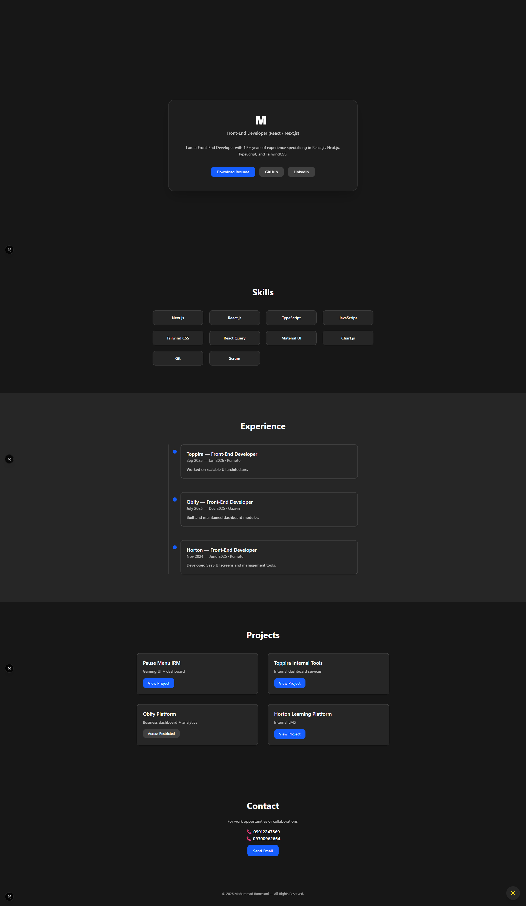

# 🚀 DaRiaN0Dev – Personal Resume Website

A clean, modern, and fully responsive resume website built with **Next.js**, **React**, and **TailwindCSS**.
This project showcases professional experience, skills, projects, and contact details in a polished, elegant UI.

---

## 📸 Demo

Below is a preview of the live design:



---

## ✨ Features

- ⚡ **Next.js 14 (App Router)**
- 📱 **Mobile-first responsive UI**
- 🎨 **Modern TailwindCSS styling**
- 🧭 Smooth sidebar menu for mobile
- 🔍 Clean layout for resume sections:
  - About Me
  - Skills
  - Experience
  - Projects
  - Contact
- 🚀 Fast and optimized for deployment

---

## 🛠️ Tech Stack

| Technology      | Purpose        |
| --------------- | -------------- |
| **Next.js 14**  | Main framework |
| **React**       | UI components  |
| **TailwindCSS** | Styling        |
| **TypeScript**  | Type safety    |
| **React Icons** | Icons library  |
| **Vercel**      | Deployment     |

---

## 📂 Project Structure

app/
├─ globals.css
├─ page.tsx
public/
├─ demo-shot.png
components/
├─ Navbar.tsx
├─ Sidebar.tsx
...

---

## 🔧 Local Installation

```bash
git clone https://github.com/DaRiaN0Dev/DaRiaN0Dev-Resume.git
cd DaRiaN0Dev-Resume
npm install
npm run dev
```

---

## 🌐 Deployment (Recommended: Vercel)

1. Go to: https://vercel.com
2. Import your GitHub repo
3. Deploy  
   Done! 🚀

---

## 📬 Contact

- **Name:** Mohammad Ramezani
- **GitHub:** https://github.com/DaRiaN0Dev
- **LinkedIn:** https://linkedin.com/in/DaRiaN0Dev
- **Email:** MohammadRamezani.work@gmail.com

---

## 📄 License

MIT License.
